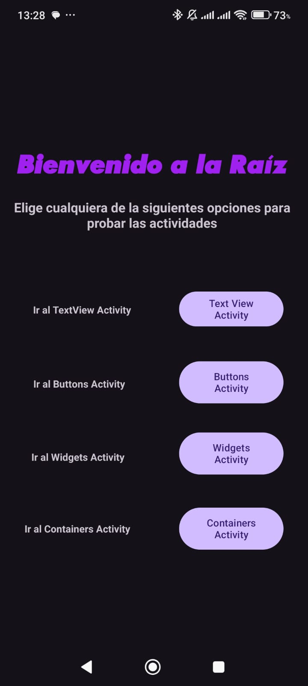
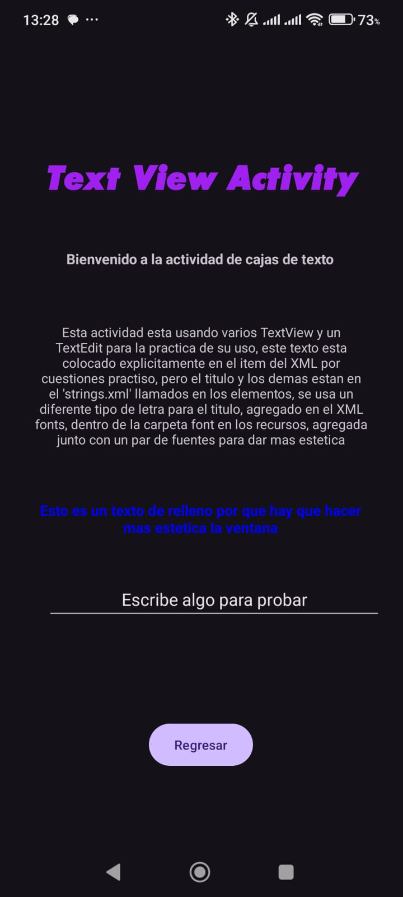
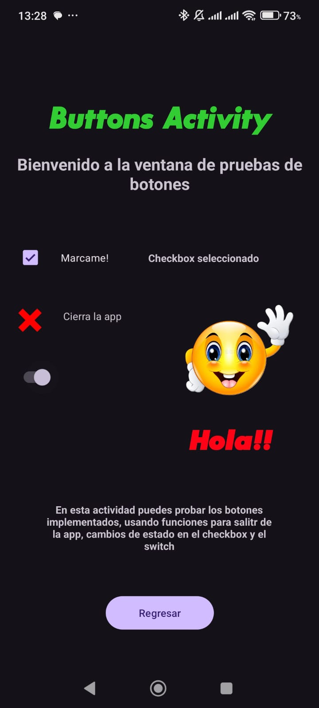
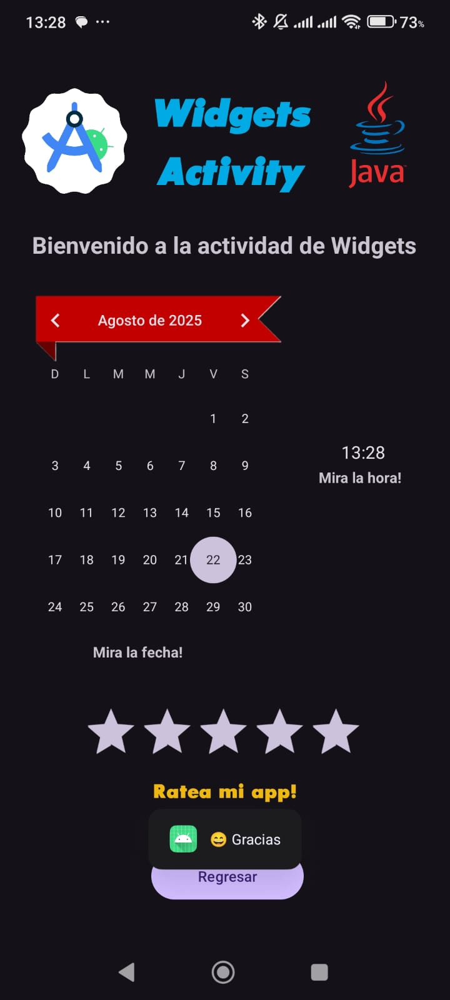
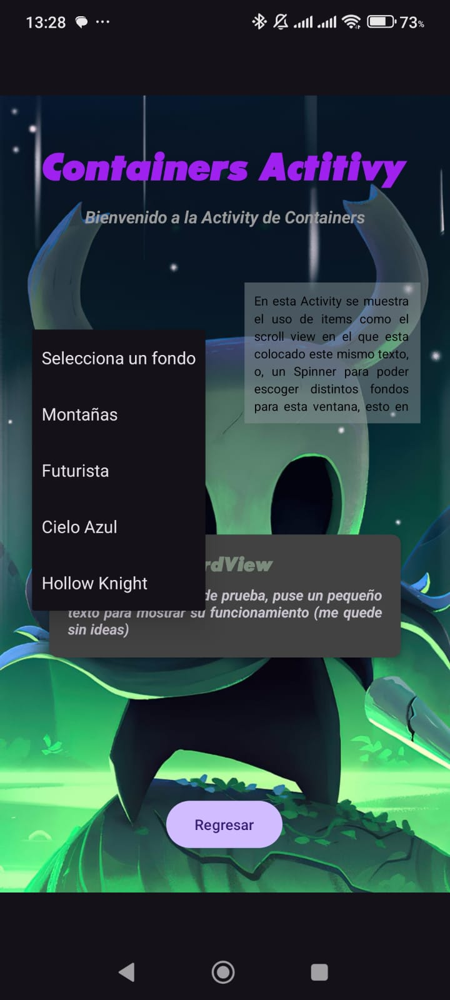

Jorge Mario Cano Cobon                                     0905-24-10433

Bienvenido a mi Repositorio para entrega de la tarea, "Android Activitys"

A continuacion puedes ver una pequeña preview de la interfaz de la APP con capturas de cada pestaña:

Imagen 1:
En esta se puede ver la pestaña raiz de la app, en ella se puede acceder a las demas pestañas a travez de botones.

Imagen 2:
En esta se puede ver una prueba de cajas de texto y cajas de texto editables, configuradas con tamaños, colores y fuentes diferentes para mejor vista, que, son usados depues.

Imagen 3:
En esta se pueden ver el uso de botones, se usan checkbox, switch y un imagebox interactivos.

Imagen 4
En esta se agregaron widgets interactivos como, un calendario, imagenes, un reloj y un rate en estrellas interactivo para cada valoracion.

Imagen 5:
En esta se ve el uso de Containers como, layouts, scrollviews y un card, ademas de un spinner para poder cambiar entre distintos fondos para la ventana.
